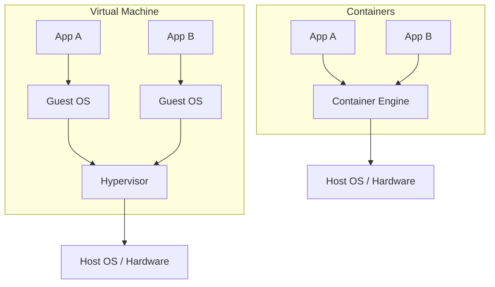

# 1. Container Fundamentals

Before diving into orchestrators like Kubernetes, it is critical to understand what a container actually is at the operating system level. 

A container is **not** a lightweight Virtual Machine. A VM virtualizes the hardware. A container virtualizes the operating system.

## How Containers Work

At their core, Linux containers rely on two foundational kernel features:

1. **Namespaces**: Provide isolation. They restrict what a process can *see* (e.g., its own process tree, network interfaces, mount points).
2. **cgroups (Control Groups)**: Provide resource limitation. They restrict what a process can *use* (e.g., maximum CPU, RAM, Disk I/O).

Because containers run directly on the host kernel, they start almost instantly and have very little overhead compared to VMs.

## Why Containers?

- **Portability**: "It works on my machine" translates to "It works everywhere." 
- **Efficiency**: Run many more applications on the same hardware compared to VMs.
- **Microservices**: Perfect for breaking down large monoliths into small, independently deployable units.
