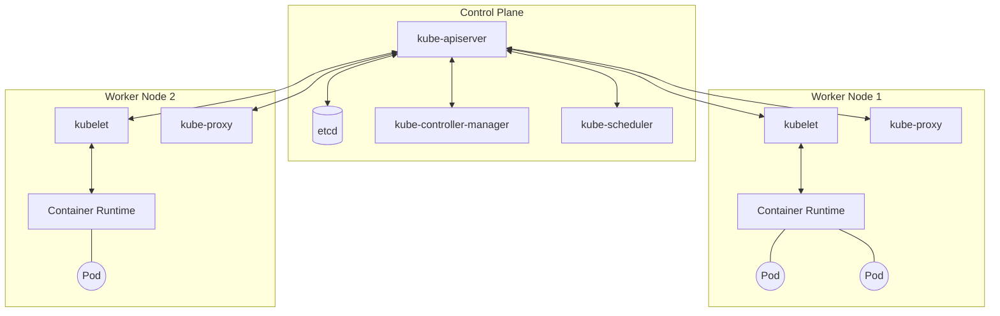

# 1. Kubernetes Architecture

Kubernetes (K8s) is a distributed system that orchestrates containerized applications. Understanding its architecture is the first step to mastering it.

A Kubernetes cluster consists of two main parts:
1. **The Control Plane**: The brains of the cluster.
2. **Worker Nodes**: The machines that run your actual workloads.

## Architecture Diagram

## The Control Plane

The Control Plane manages the worker nodes and the Pods in the cluster.

- **kube-apiserver**: The frontend of the control plane. All communication goes through here.
- **etcd**: Consistent and highly-available key value store used as Kubernetes' backing store for all cluster data.
- **kube-scheduler**: Watches for newly created Pods with no assigned node, and selects a node for them to run on.
- **kube-controller-manager**: Runs controller processes (like node controllers, replica controllers).

::: warning
Never lose your `etcd` data! In a production cluster, ensure `etcd` is backed up regularly, as losing it means losing the state of your entire cluster.
:::

## Worker Nodes

Nodes are the physical or virtual machines that run your applications.

- **kubelet**: An agent that runs on each node. It ensures that containers are running in a Pod.
- **kube-proxy**: A network proxy that runs on each node, maintaining network rules that allow network communication to your Pods.
- **Container Runtime**: The software that is responsible for running containers (e.g., containerd, CRI-O).

::: tip
In managed Kubernetes services like EKS, GKE, or AKS, the cloud provider manages the Control Plane for you. You only manage the Worker Nodes.
:::
