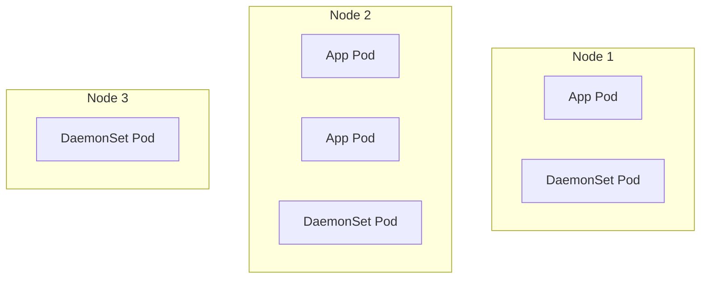

# 12. DaemonSets

A **DaemonSet** ensures that a copy of a specific Pod runs on all (or a subset of) Nodes in the cluster.

As nodes are added to the cluster, Pods are added to them. As nodes are removed from the cluster, those Pods are garbage collected. Deleting a DaemonSet will clean up the Pods it created.

## Common Use Cases

DaemonSets are perfect for cluster-wide infrastructure agents:

1. **Log Collection**: Running a `fluentd` or `logstash` daemon on every node to ship logs to a centralized server.
2. **Node Monitoring**: Running Prometheus Node Exporter, Datadog Agent, or OpenTelemetry collector on every node.
3. **Cluster Storage**: Running a Ceph or GlusterFS daemon on every node to provide a distributed storage layer.

## How it works

Unlike a Deployment which schedules Pods anywhere there is capacity, a DaemonSet instructs the scheduler to strictly place one Pod per Node.



## Example YAML

```yaml
apiVersion: apps/v1
kind: DaemonSet
metadata:
  name: fluentd-elasticsearch
  namespace: kube-system
  labels:
    k8s-app: fluentd-logging
spec:
  selector:
    matchLabels:
      name: fluentd-elasticsearch
  template:
    metadata:
      labels:
        name: fluentd-elasticsearch
    spec:
      tolerations:
      - key: node-role.kubernetes.io/master
        effect: NoSchedule
      containers:
      - name: fluentd-elasticsearch
        image: quay.io/fluentd_elasticsearch/fluentd:v2.5.2
```

::: info
Notice the `tolerations` block. By default, master/control-plane nodes have a taint that prevents normal Pods from scheduling on them. We add a toleration so our log collector runs on the master nodes too!
:::
