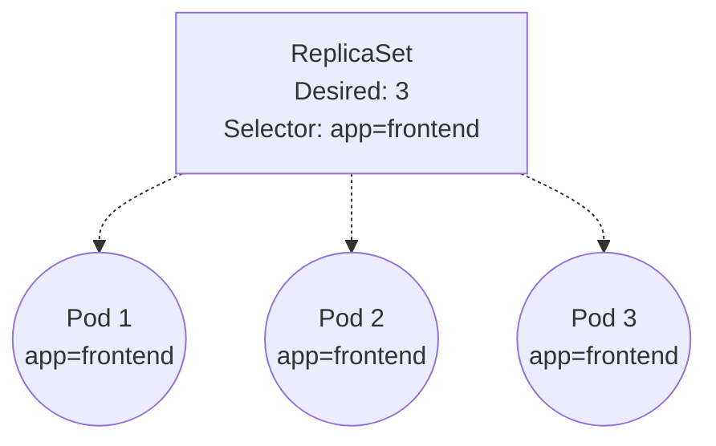

# 3. ReplicaSets

Before deploying applications to production using **Deployments**, it is critical to understand the underlying object that actually keeps your Pods running: the **ReplicaSet**.

## What is a ReplicaSet?

A ReplicaSet's purpose is to maintain a stable set of replica Pods running at any given time. As such, it is often used to guarantee the availability of a specified number of identical Pods.

If a Pod crashes or is deleted, the ReplicaSet controller notices that the current number of running Pods is less than the desired number, and spins up a new one to replace it.

## How it works

ReplicaSets link to Pods via **Label Selectors**.



If you manually create a Pod with the label `app=frontend` while the ReplicaSet already has 3 running, the ReplicaSet will instantly terminate your manually created Pod because it exceeds the desired count of 3.

## Creating a ReplicaSet

You rarely create a ReplicaSet directly (you use a Deployment instead), but here is what the raw YAML looks like:

```yaml
apiVersion: apps/v1
kind: ReplicaSet
metadata:
  name: frontend
  labels:
    app: guestbook
    tier: frontend
spec:
  replicas: 3
  selector:
    matchLabels:
      tier: frontend
  template:
    metadata:
      labels:
        tier: frontend
    spec:
      containers:
      - name: php-redis
        image: gcr.io/google_samples/gb-frontend:v3
```

::: warning
**Why don't we use ReplicaSets directly?**
While a ReplicaSet guarantees *N* pods are running, it does not understand **updates**. If you change the image in the ReplicaSet template from `v1` to `v2`, the ReplicaSet will *not* restart existing Pods. It will only use `v2` for newly created Pods. For seamless, rolling updates, we wrap ReplicaSets in a **Deployment**.
:::
