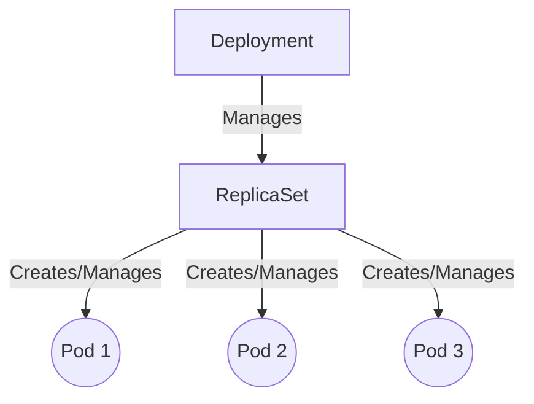

# 4. Deployments

While Pods are the basic unit of execution, they are ephemeral. If a node fails, the Pods on it are gone forever. **Deployments** solve this problem by providing declarative updates and self-healing for Pods.

## How Deployments Work

A Deployment manages a **ReplicaSet**, which in turn manages the Pods. 



If you tell a Deployment you want 3 replicas of your application, the ReplicaSet ensures exactly 3 Pods are running at all times. If a Pod crashes, the ReplicaSet automatically starts a new one.

## Creating a Deployment

Here is an example `deployment.yaml`:

```yaml
apiVersion: apps/v1
kind: Deployment
metadata:
  name: nginx-deployment
  labels:
    app: nginx
spec:
  replicas: 3
  selector:
    matchLabels:
      app: nginx
  template:
    metadata:
      labels:
        app: nginx
    spec:
      containers:
      - name: nginx
        image: nginx:1.24
        ports:
        - containerPort: 80
```

Notice the `template` section. This is exactly the same as a Pod definition. The Deployment uses this template to stamp out new Pods.

### Common Commands

Create or update the deployment:
```bash
kubectl apply -f deployment.yaml
```

Check the status of the rollout:
```bash
kubectl rollout status deployment/nginx-deployment
```

Scale the deployment manually:
```bash
kubectl scale deployment nginx-deployment --replicas=5
```

::: tip
**Rolling Updates**: Deployments allow you to update your application with zero downtime. When you change the image version in your Deployment, Kubernetes will gradually replace old Pods with new ones, ensuring a minimum number of Pods are always available to serve traffic.
:::
