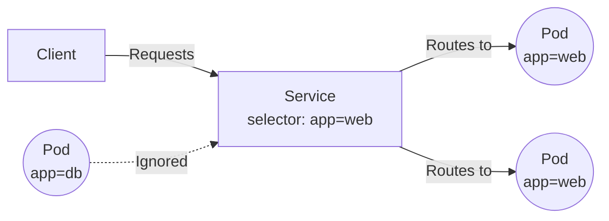

# 5. Services

Because Pods are ephemeral and their IP addresses change every time they are recreated, we need a stable way to communicate with them. 

A **Service** is an abstract way to expose an application running on a set of Pods as a network service.

## Service Types

1. **ClusterIP** (Default): Exposes the Service on a cluster-internal IP. This makes the Service only reachable from within the cluster.
2. **NodePort**: Exposes the Service on each Node's IP at a static port. You can contact the NodePort Service from outside the cluster by requesting `<NodeIP>:<NodePort>`.
3. **LoadBalancer**: Exposes the Service externally using a cloud provider's load balancer.

## How Services Find Pods

Services use **Labels** and **Selectors** to route traffic to the correct Pods.



## Creating a Service

Here is a `service.yaml` that exposes the NGINX deployment we created in the previous chapter:

```yaml
apiVersion: v1
kind: Service
metadata:
  name: nginx-service
spec:
  selector:
    app: nginx
  ports:
    - protocol: TCP
      port: 80         # Port exposed by the Service
      targetPort: 80   # Port the container is listening on
  type: ClusterIP
```

### Common Commands

Apply the Service:
```bash
kubectl apply -f service.yaml
```

List Services:
```bash
kubectl get svc
```

Describe a Service to see the Endpoints (the actual Pod IPs it is routing to):
```bash
kubectl describe svc nginx-service
```

::: info
If you describe a Service and the `Endpoints` list is empty, it means your Service's `selector` labels do not match any running Pods' labels! This is the #1 cause of networking issues in Kubernetes.
:::
