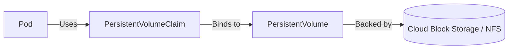

# 7. Volumes & Storage

Containers are ephemeral. When a container crashes or stops, all of its local files are lost. Kubernetes **Volumes** solve this problem by providing persistent storage that survives container restarts.

## Persistent Volumes (PV) and Claims (PVC)

To manage storage efficiently at scale, Kubernetes uses a subsystem to decouple storage provisioning from storage consumption.

1. **PersistentVolume (PV)**: A piece of storage in the cluster that has been provisioned by an administrator or dynamically provisioned using Storage Classes.
2. **PersistentVolumeClaim (PVC)**: A request for storage by a user/Pod.



## Creating a PVC

Here is how you request 5 Gigabytes of storage:

```yaml
apiVersion: v1
kind: PersistentVolumeClaim
metadata:
  name: my-pvc
spec:
  accessModes:
    - ReadWriteOnce
  resources:
    requests:
      storage: 5Gi
```

## Using the PVC in a Pod

Once the claim is bound to a PV, you can mount it into your Pod:

```yaml
apiVersion: v1
kind: Pod
metadata:
  name: storage-pod
spec:
  containers:
  - name: storage-container
    image: nginx
    volumeMounts:
    - mountPath: "/var/www/html"
      name: my-storage
  volumes:
  - name: my-storage
    persistentVolumeClaim:
      claimName: my-pvc
```

::: tip
**Access Modes**: 
- `ReadWriteOnce`: The volume can be mounted as read-write by a single node.
- `ReadOnlyMany`: The volume can be mounted read-only by many nodes.
- `ReadWriteMany`: The volume can be mounted as read-write by many nodes (typically requires NFS or similar network file systems).
:::
