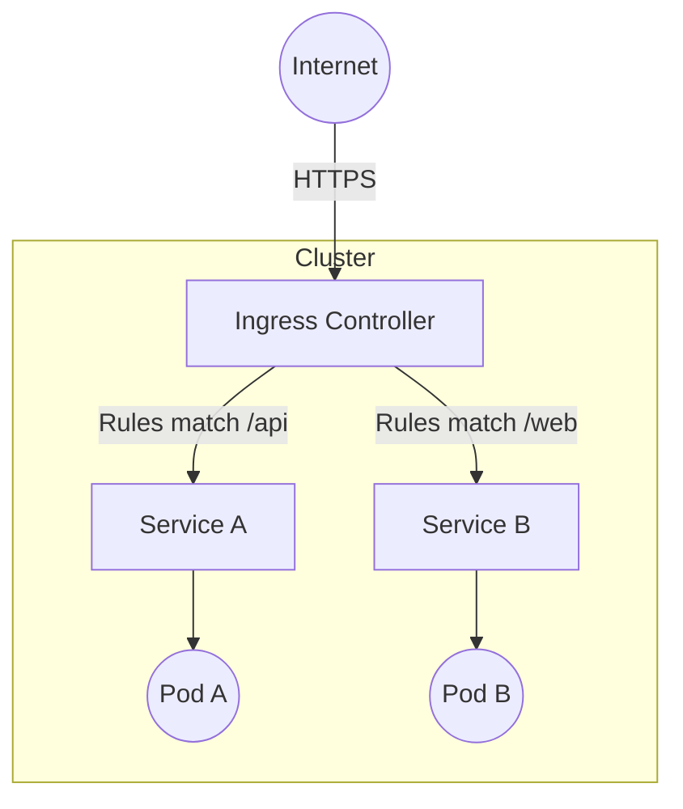

# 8. Ingress

While a `LoadBalancer` Service provides a way to expose an application externally, it typically provisions a new cloud load balancer (and IP address) for *every* service you expose, which can become very expensive.

An **Ingress** is an API object that manages external access to the services in a cluster, typically HTTP/HTTPS. Ingress may provide load balancing, SSL termination, and name-based virtual hosting.

## How Ingress Works

You deploy an **Ingress Controller** (like NGINX Ingress Controller, Traefik, or AWS ALB Ingress Controller), which listens for `Ingress` objects and routes traffic accordingly.



## Creating an Ingress

Here is an example that routes traffic based on the hostname and path:

```yaml
apiVersion: networking.k8s.io/v1
kind: Ingress
metadata:
  name: minimal-ingress
spec:
  rules:
  - host: my-app.example.com
    http:
      paths:
      - path: /api
        pathType: Prefix
        backend:
          service:
            name: api-service
            port:
              number: 8080
      - path: /
        pathType: Prefix
        backend:
          service:
            name: web-service
            port:
              number: 80
```

### Common Commands

Apply the Ingress:
```bash
kubectl apply -f ingress.yaml
```

List Ingresses to find the public IP address:
```bash
kubectl get ingress
```

::: note
An Ingress resource requires an Ingress Controller to be running in your cluster. Creating the resource alone will do nothing.
:::
